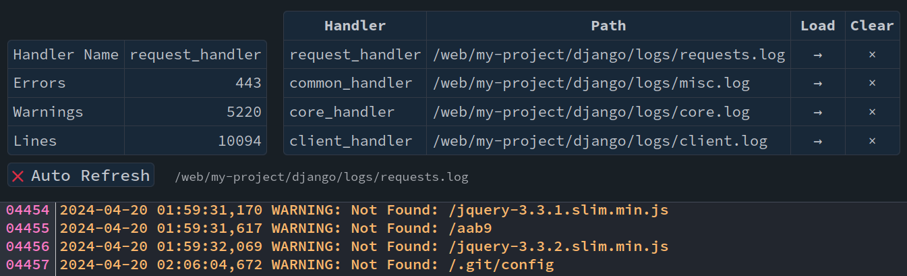
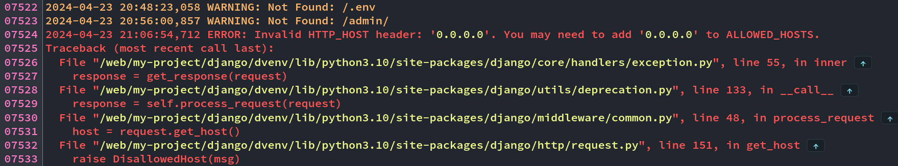
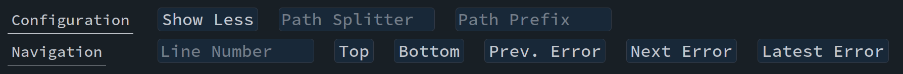
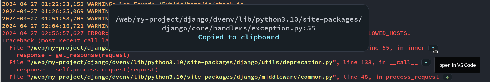

# Django Log Lens

Django Log Lens is a dependency-free logging app for Django.
It provides a management web interface to view, search, download, archive, and clear log files
while also serving as a tool for debugging client- and server-side errors.

[Get started &rarr;](getting-started.md){ .md-button .md-button--primary }

## Features

### Overview of Accessible Handlers and the Corresponding Log Files

The file handlers of your `LOGGING` configuration are listed together with their log files —
there is no separate list of log files to maintain. From here, a log file can be loaded,
downloaded, archived, or cleared.

### Semantically Highlighted Logs in Your Browser

Log levels are color-coded based on the level prefix added by `LOG_FORMAT` / `LEVEL_PREFIX`,
or on a level name like `ERROR` or `WARNING` at the beginning of a line — so any format
starting with `%(levelname)s` works as well (see [Getting Started](getting-started.md)).

### Navigation through Log Files

Jump to the next or previous error in the currently loaded log file.

### Navigation through Source Code

- Click on a path in a log message to copy it to the clipboard
- Click on the <kbd>&uarr;</kbd> button to open the referenced line in VS Code
- Adjust the <kbd>Path Splitter</kbd> and the <kbd>Path Prefix</kbd> to match your project structure
  (see the [FAQ](faq.md) for an example)

### Review of Backed-up Log Files

Rotated backup files written by handlers such as `RotatingFileHandler` or
`TimedRotatingFileHandler` (e.g. `debug.log.1` or `debug.log.2024-01-01`) are discovered
automatically. They appear in a *Backup* dropdown next to their primary log file on the
*Sources* tab and can be viewed and downloaded like any other log source.

### Global Search

The *Search* tab searches all log sources server-side for a substring, optionally
case-sensitive. Matches are grouped by log source and listed with their line numbers;
clicking a match opens the corresponding source in the log view and jumps to that line.
A log source can also be archived directly from its search results.

### Archive

A log source can be copied to an `archive/` folder next to the log file, with a timestamp
appended to the file name — for example, to preserve its current content before clearing it.
The *Archive* tab lists all archived copies with their timestamp and size and allows
viewing, downloading, and deleting them. Archived files are excluded from the global search
and cannot be cleared.

### Client Logging

Forward `console.debug/info/warn/error` calls from the browser to your Django log files by adding a
single template tag — see [Client Logging](client-logging.md).
